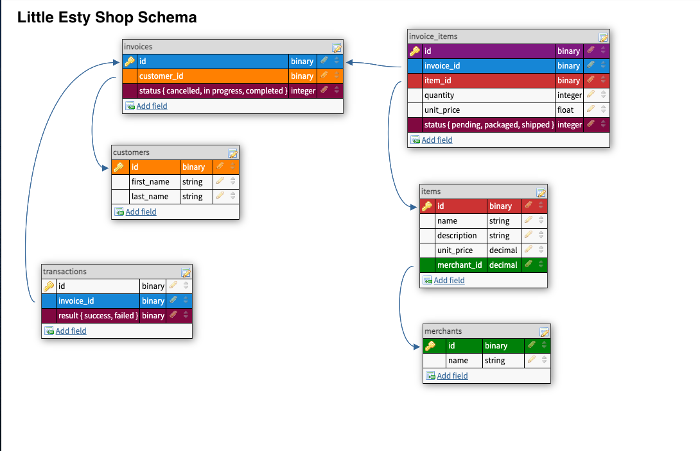

# Little Esty Shop

## Project Function (what it does)
  **Little Esty Shop** is an e-commerce application that supports multiple merchants selling multiple items. There are both admin and merchant functionalities for the user.  
  There are built in data files for seed functionalities. See [#installation] for how to utilize on your local repository.

## Database Schema
The schema represents the relationships between the models in the database.
  - A Merchant can have many items.
  - A Merchant can have many customers, through invoice items. etc

## How to install it
- Fork this repository
- Clone to local  
  `git clone <local_repo_name>`
- Install gems  
  `bundle install`
- Drop, create, and migrate the database  
  `rails db{:drop,:create,:migrate}`
- Load the seed data   
  `rails csv_load:all`

##
